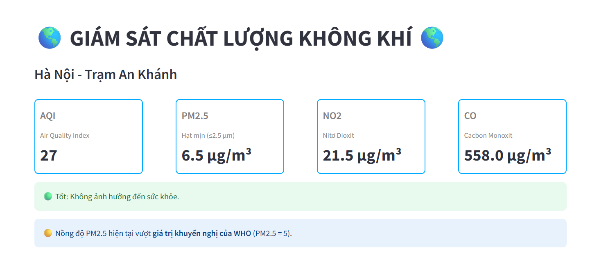
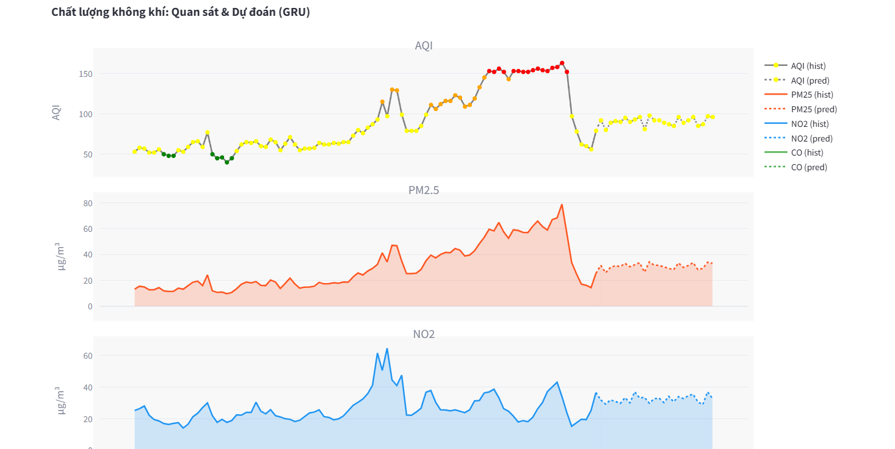

# Real-time Air Quality Forecasting System using Deep Learning and Docker




## Table of Contents
1. [Overview](#overview)
2. [Key Features](#key-features)
3. [Technologies Used](#technologies-used)
4. [Data Source](#data-source)
5. [Deep Learning Models](#deep-learning-models)
6. [Evaluation Metrics](#evaluation-metrics)
7. [Setup and Deployment](#setup-and-deployment)
8. [Results and Discussion](#results-and-discussion)

## Overview <a name="overview"></a>

Air pollution is an alarming global concern, contributing to an estimated 7 million premature deaths annually. Cities like Hanoi consistently rank among the most polluted worldwide, with PM2.5 concentrations significantly exceeding WHO recommendations. In this critical context, Real-time Air Quality Forecasting (RT-AQF) plays a vital role in early detection of pollution risks, enabling timely response measures, and informing sustainable urban planning and emission control policies.

This project aims to address these challenges by building a robust RT-AQF system. It leverages the power of deep learning models and Docker containerization to create a flexible, scalable, and automated deployment solution for air quality prediction.

## Key Features <a name="key-features"></a>

*   **Data Collection**: Automated collection of historical and real-time air quality data from the **OpenAQ API**.
*   **Data Preprocessing & EDA**: Comprehensive exploratory data analysis (EDA) and preprocessing steps to handle noisy, missing, and non-stationary time series data, including feature engineering for temporal characteristics (`hour`, `dayofweek`, `is_holiday`).
*   **Deep Learning Models**: Implementation and training of Recurrent Neural Networks (RNN), Long Short-Term Memory (LSTM), and Gated Recurrent Units (GRU) for multivariate-to-multivariate time series forecasting.
*   **Performance Evaluation**: Models are evaluated using key metrics: Mean Absolute Error (MAE), Root Mean Square Error (RMSE), and R-squared (R²).
*   **Composite Air Quality Index (AQI) Calculation**: Integration of AQI calculation to provide a comprehensive assessment of air quality.
*   **REST API Backend**: Development of a high-performance backend using **FastAPI** to serve real-time predictions.
*   **Interactive Dashboard with Real-time Updates**: A user-friendly frontend interface for visualizing predictions and real-time data.
*   **Containerization**: System packaging with **Docker** for easy and consistent deployment across various environments.

## Technologies Used <a name="technologies-used"></a>

*   **PyTorch**: Open-source deep learning framework for building and training neural network models.
*   **FastAPI**: Modern, fast (high-performance) web framework for building APIs with Python 3.7+.
*   **Docker**: Platform for developing, shipping, and running applications in containers.

## Data Source <a name="data-source"></a>

The project utilizes air quality data from **OpenAQ**, a non-profit organization providing open access to air quality measurements globally. Specifically, data was collected from the **An Khanh station in Hanoi, Vietnam**. The dataset includes measurements for:
*   **PM2.5**: Fine particulate matter (aerodynamic diameter ≤ 2.5 µm).
*   **PM10**: Particulate matter (aerodynamic diameter ≤ 10 µm).
*   **CO (Carbon Monoxide)**: A colorless, odorless, and toxic gas.
*   **NO₂ (Nitrogen Dioxide)**: A reddish-brown gas with a pungent odor, contributing to acid rain and ozone formation.

## Deep Learning Models <a name="deep-learning-models"></a>

Three primary deep learning architectures suitable for time series forecasting were implemented and compared:

*   **Recurrent Neural Network (RNN)**: A class of neural networks designed to recognize data's sequential characteristics and use patterns to predict the next probable scenario.
*   **Long Short-Term Memory (LSTM)**: An advanced type of RNN specifically designed to address the vanishing gradient problem and learn long-term dependencies in sequential data through gated mechanisms (forget, input, and output gates).
*   **Gated Recurrent Unit (GRU)**: A simpler variant of LSTM, combining the forget and input gates into a single update gate, and also merging the cell state and hidden state, leading to fewer parameters and faster training.

## Evaluation Metrics <a name="evaluation-metrics"></a>

The performance of the models was quantitatively assessed using:

*   **Mean Absolute Error (MAE)**: Measures the average magnitude of errors in a set of predictions, without considering their direction. It is less sensitive to outliers.
*   **Root Mean Square Error (RMSE)**: Measures the square root of the average of the squared differences between predicted and actual values. It penalizes large errors more heavily due to the squaring effect and is sensitive to outliers.
*   **R-squared (R²)**: The coefficient of determination, indicating the proportion of the variance in the dependent variable that is predictable from the independent variables.

## Setup and Deployment <a name="setup-and-deployment"></a>

Follow these steps to set up and run the air quality forecasting system, including the backend API, model training, and the interactive dashboard:

1.  **Clone the Repository**:
    ```bash
    git clone https://github.com/nmhongtram/air-quality-forecasting.git
    cd air-quality-forecasting
    ```

2.  **Install Dependencies**:
    It's recommended to create a virtual environment:
    ```bash
    python -m venv venv
    source venv/bin/activate # On Windows: .\venv\Scripts\activate
    pip install -r requirements.txt
    ```

3.  **Train Models**:
    The deep learning models need to be trained first to generate the `.pth` weight files.
    ```bash
    python model/train.py
    ```
    This script will collect data, preprocess it, and train the RNN, LSTM, and GRU models, saving the best performing weights.

4.  **Build and Run with Docker Compose (or Docker Swarm for distributed deployment)**:
    Navigate to the project root directory where `docker-compose.yml` is located and run:
    ```bash
    docker-compose up --build
    ```
    This command will build the Docker images for both the backend API and the frontend dashboard and start them inside containers. For large-scale distributed deployment, the system can be deployed on a Docker Swarm with many Docker machines.

5.  **Access the System**:
    Once the system is running, you can access:
    *   **Interactive API Documentation (Swagger UI)**: `http://localhost:8000/docs`
        This interactive documentation allows you to explore endpoints and send direct requests.
    *   **Prediction Endpoint**: `http://127.0.0.1:8000/predict` or `http://localhost:8000/predict`
        You can specify the forecasting `ahead` hours (default 24, max 24) and `model_name` (RNN, LSTM, GRU) as query parameters.
        Example: `http://localhost:8000/predict?ahead=24&model_name=lstm`
    *   **Real-time Dashboard**: `http://127.0.0.1:8501/`

## Results and Discussion <a name="results-and-discussion"></a>

All three models (RNN, LSTM, GRU) demonstrated good convergence during training, with loss values decreasing steadily. **LSTM showed the most stable convergence and better control over overfitting** compared to RNN and GRU, especially in later epochs.

On the original data scale, RNN yielded the lowest MAE (79.27) and RMSE (169.81), and the highest R² (0.61) among the three models. While R² values ranging from 0.57 to 0.61 are acceptable, they indicate that the models explain about 57-61% of the variability in the actual data.

The performance was notably impacted by several inherent limitations of the collected time series data, including:
*   **Non-stationarity**: Lack of clear trends or seasonality.
*   **Skewed and Kurtotic Distributions**: Data distributions were not normal.
*   **Numerous Outliers**: Presence of extreme values.
*   **Significant Data Gaps**: Large periods with missing data.

Despite these data challenges, **LSTM was identified as the optimal model for the future development of a distributed pipeline** due to its superior overfitting control. The system now includes not only continuous predictions for CO, NO₂, and PM2.5 but also the calculation of the composite Air Quality Index (AQI). The results of the predictions are visualized on the interactive dashboard, offering real-time updates and an intuitive overview of air quality.

---
---
>
> This project was developed by Group 08 from the University of Economics Ho Chi Minh City (UEH), School of Technology and Design, Department of Business Information Technology, as part of a High Performance Computing (HPC) course.
>
> *   **Nguyễn Mai Hồng Trâm** (Team Leader)
> *   **Nguyễn Ngọc Thúy Anh**
> *   **Đỗ Ngọc Phương Anh**
> *   **Huỳnh Minh Phương**
> *   **Trần Vọng Triển**